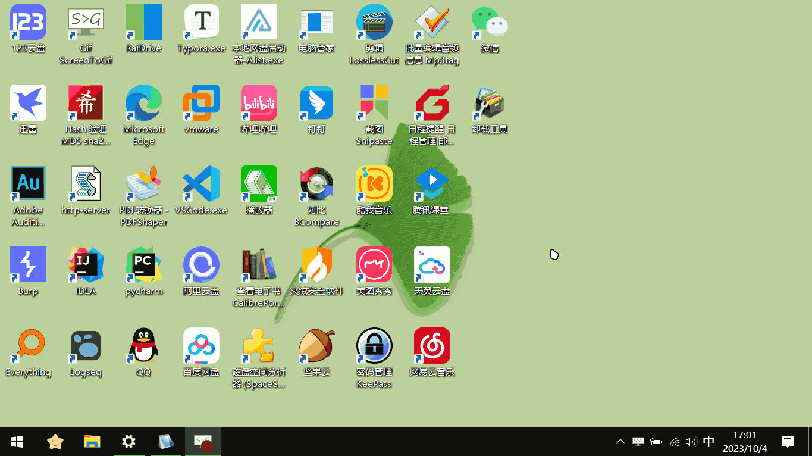

pick：快捷打开应用——通过指定名称关键字打开相关应用的程序

使用效果：

使用场景：

需要内存占用较少, 电脑应用较多的场景。适用于 win10、win7。

win11 测试使用效果不佳。

同功能软件推荐:

- Listary 
  - 优秀的**文件搜索管理 & 快速启动程序**，实测后台内存使用 100MB 左右
  - [Listary 本地文件高效搜索工具，使用技巧 - 知乎](https://zhuanlan.zhihu.com/p/587249600)

- uTools
  - 全局搜索 + 效率工具
  - [uTools 相关介绍 - Topbook -bilibili](https://www.bilibili.com/video/BV1g64y1Q7PH/) 
  
- Wox & Everything：
  - [Wox 相关介绍 - ViccoVlog bilibili](https://www.bilibili.com/video/BV14J41197GF/)
  
- Quicker & Everything：

  - [Quicker 动作-智搜](https://getquicker.net/Sharedaction?code=152618d3-6c3c-49e8-afef-08d8f6743496)

  - [Quicker 相关介绍 - Topbook -bilibili](https://www.bilibili.com/video/BV1Z4411E7WJ/) 

脚本说明：

`cd.vbs`：用于打开指定文件夹中的常用的文件夹（快捷方式）

`open_检索指定路径.vbs`：用于打开指定文件夹中的某个应用

`open_检索桌面.vbs`：用于打开桌面中的某个应用

`way.bat`：检索器

`.NotFound.bat`：用于未找到提示

配置方法：

1. 修改检索路径：将 `vbs` 文件中 `"searchPath = "` 后的值修改为指定文件夹(桌面或其他应用快捷方式所在文件夹)

2. 配置环境变量：确保要使用的 `vbs` 脚本的快捷方式所在的文件夹在环境变量 path 中

3. （新手模式）使用快捷键 `win + R` 打开运行窗口后，输入配 `脚本快捷方式的名称` 回车 根据提示输入某个应用的部分名称即可

   （常用模式）使用快捷键 `win + R` 打开运行窗口后，输入`脚本快捷方式的名称 + 空格 + 某个应用的部分名称`即可

文件匹配方式： 包含所有指定关键字、在文件名(不含后缀名)最短的前提下, 匹配全路径按照名称排序在首位的文件

程序特点：

- 检索自定义路径，需在 `vbs` 文件中指定路径，使用统一的检索器 `way.bat`
- 路径中可包含空格、支持中文路径
- 支持无参数打开（打开程序文件所在路径）
- 支持双参数无序模糊搜索，如输入 `音乐 网易` 能打开网易云音乐
- 添加未找到提示（`.NotFound.bat`）
- 支持自动捕获桌面路径
- 新手模式：可进入命令行输入关键字，提高交互，参数数量不限，会提示检索结果
- 常用模式：在运行窗口直接输入文件名，参数最多两个，没找到相关文件时会提示
- 支持多文件夹检索，默认最多同时支持三个, 可自定义扩展

主要更新：

- 使用统一的检索器 `way.bat`（pick_v1.9.3）
- 支持多文件夹检索（pick_v1.10.0）
- 优化 cd 多次打开同一文件夹快捷方式闪退的问题（pick_v1.10.3）

BUG 记录 :  

- 当文件名或路径中包含 `(`  `)`  `!` `%` `^` 5个字符时可能无法找到相关路径

 关于文件编码有两种方案：

1. bat 使用 UTF-8，vbs 使用 UTF-16LE
2. bat 和 vbs 都使用 GBK 或使用 ANSI（使用 ANSI 含中文会默认转 GBK）

